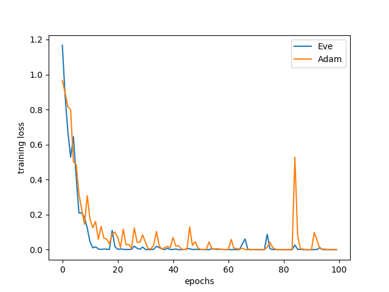
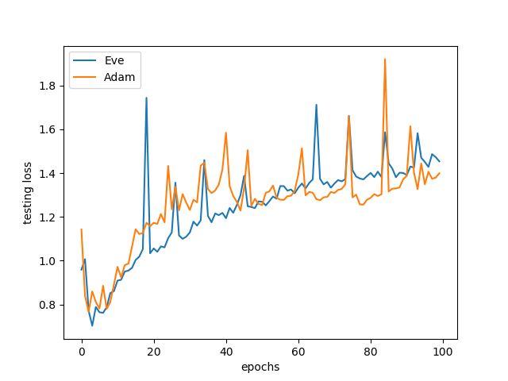

# Eve.pytorch

An implementation of **Eve Optimizer**, proposed in *Imploving Stochastic Gradient Descent with Feedback*, Koushik and Hayashi, 2016([arXiv](https://arxiv.org/abs/1611.01505)).

Comparison of training loss with Adam. Parameters are their default values. 

